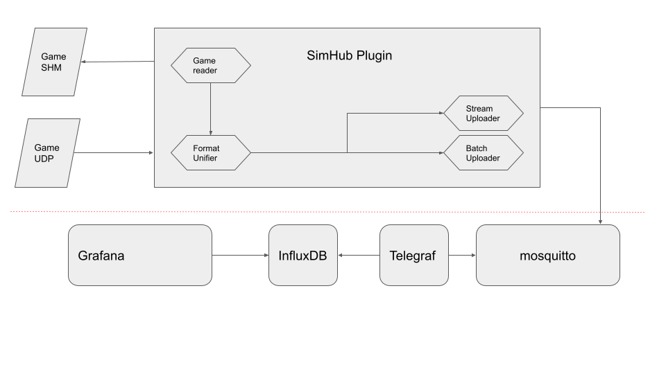
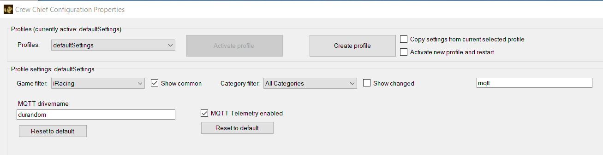
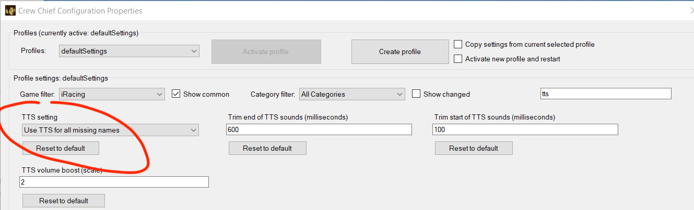
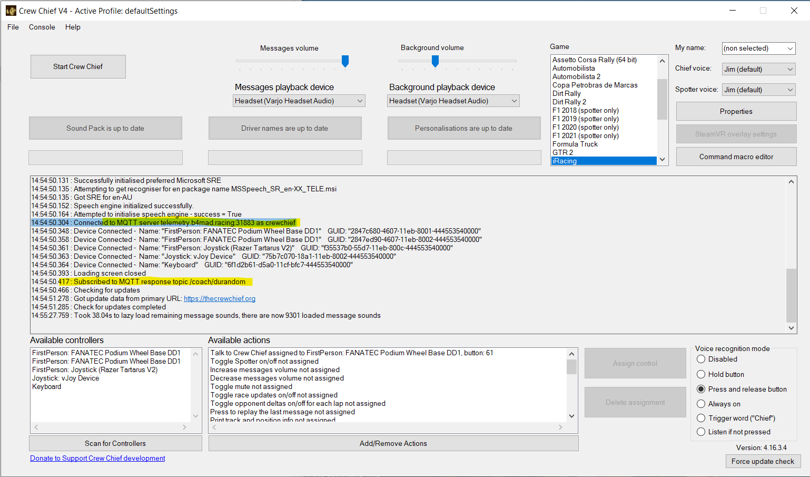
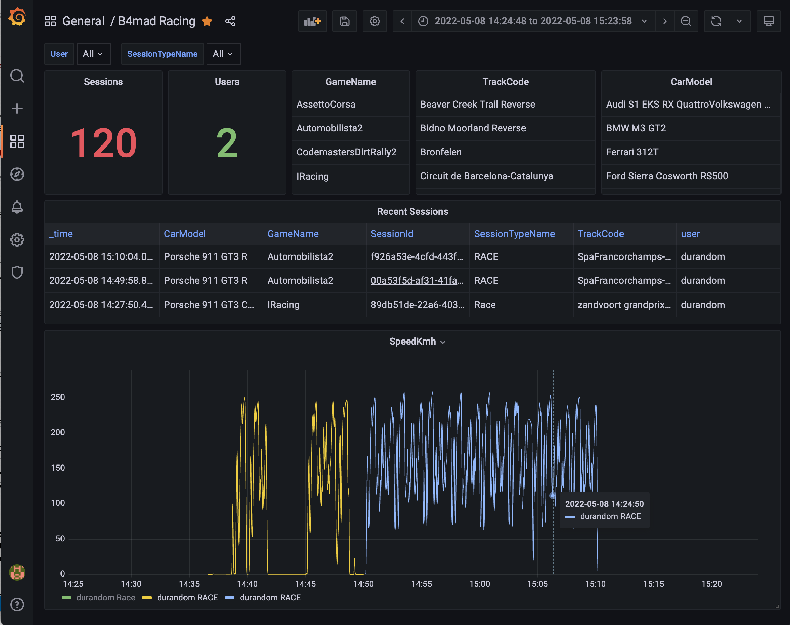

# [#B4mad racing](https://b4mad.racing)

> Community driven SimRacing data collection and analysis.

## A telemetry data collection and analysis pipeline for simracers :racing_car:

The pipeline start at [CrewChief](https://thecrewchief.org/).
This means we can take data in from any simulation that CrewChief supports.
CrewChief will send your simulator telemetry data to an endpoint hosted on the [Operate First Community Cloud](https://www.operate-first.cloud).
You can then visualize your telemetry data in our [B4mad Pitwall](https://pitwall.b4mad.racing/)
or do some [data science](ai/)



## Installation

1. Install [CrewChief](https://thecrewchief.org/)
2. Enable the telemetry collection by checking 'MQTT Telemetry enabled' in the CrewChief Properties
3. Choose a 'MQTT drivername' in the CrewChief Properties 
4. Enable text to speech 
5. If all works you should see connection messages in the CrewChief console 
6. Join our [Discord](https://discord.com/invite/MaUQuSGSbJ) and say hello :wave:

Drive some laps to send some initial data. Now any time you run your simulator you will be sending data.

## Coaches

At [Paddock](https://paddock.b4mad.racing) find your drivername and enable the coach.

## Visualization

Head over to the [B4mad Pitwall](https://pitwall.b4mad.racing) and explore your
recent sessions or signup for an account to create new dashboards.



Check out the [flux scratchpad](flux/SCRATCH.flux) for some
[flux](https://docs.influxdata.com/flux/v0.x/) query examples.

## Hacking

## docker-compose stack

```shell
cd docker-compose
docker-compose up
```

### influx

Go to http://localhost:8086/ and login with [configuration.env](docker-compose/configuration.env)
and explore the racing bucket

- https://github.com/InfluxCommunity/InfluxDBv2_Telegraf_Docker

#### connecting to influx

```shell
# create a config with a reader token
influx config create --active -n b4mad_reader -u https://telemetry.b4mad.racing -t "citqAMr66LLb25hvaaZm2LezOc88k2ocOFJcJDR6QB-RmLJa_-sAr9kYB4vSFYaz8bt26lm7SokVgpQKdgKFKA==" -o b4mad

# count the number of sessions in the last 24 hours
influx query 'from(bucket:"racing") |> range(start:-1d) |> keep(columns: ["SessionId"])|> group()|> distinct(column: "SessionId") |> count()'
Result: _result
Table: keys: []
                _value:int
--------------------------
                      1788

```

### telegraf

```shell
docker compose exec telegraf cat /tmp/metrics.out
docker compose restart telegraf
```

### mosquitto

publish stuff

```shell
docker-compose exec mosquitto mosquitto_pub  -u admin -P admin -t racing -m '{"a": 5}'
docker-compose exec mosquitto mosquitto_pub  -u admin -P admin -t racing -m "`cat ../sample-small.json`"
```

subscribe

```shell
docker-compose exec mosquitto mosquitto_sub  -u admin -P admin -t racing/\# -d
docker-compose exec mosquitto mosquitto_sub  -p 31883 -h telemetry.b4mad.racing -u admin -P admin -t crewchief/\# -d
```

- <https://github.com/eclipse/paho.mqtt.python>
- <https://github.com/kevinboone/mosquitto-openshift>

### grafana

Export data sources

```shell
curl -s "http://localhost:3000/api/datasources" -u admin:admin | jq -c -M '.[]'
```

# CD

[](https://argocd.operate-first.cloud/applications/racing-smaug)
