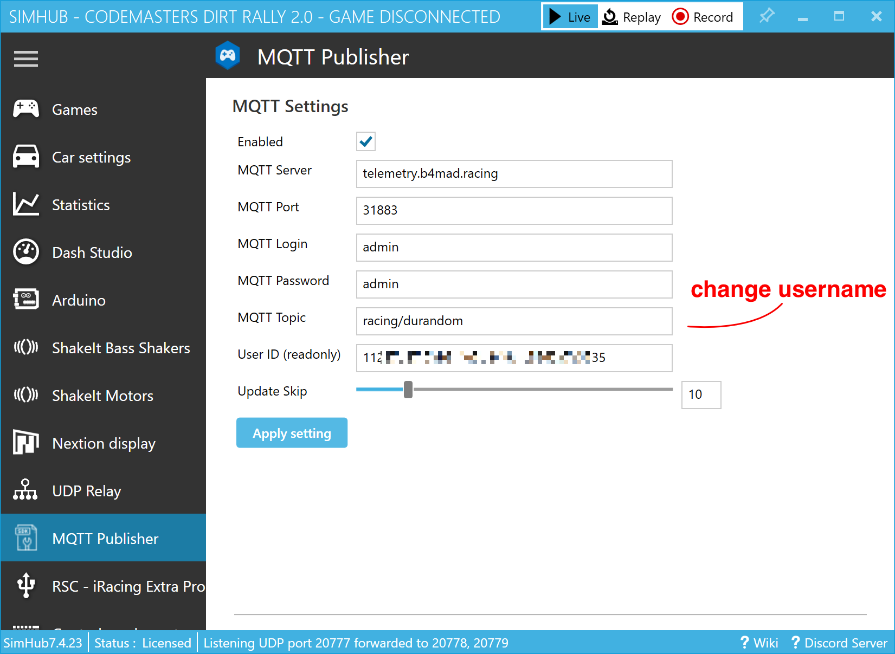

# B4mad racing

https://b4mad.racing - https://pitwall.b4mad.racing

### A telemetry data collection pipeline for simracers :racing_car:

The current implementation allows you to collect telemetry data from multiple racing games via a [SimHub](https://www.simhubdash.com/) Plugin, which will send the data to a server in the cloud, where it's stored in a time-series database. You can then visualize the data in a customizable dashboarding tool.


## Installation

Install [SimHub](https://www.simhubdash.com/) and install the [MQTT Publisher plugin](https://nightly.link/durandom/SimHub-MQTT-Publisher/workflows/dotnet/main/release-artifact.zip) by unziping the contents into the SimHub folder at `C:\Program Files (x86)\SimHub`

In the plugin settings you should adjust the topic to include your username, i.e. replace `durandom` with your name. The username is arbitrary, just pick something just with letters and numbers - no special characters like symbols, a slash / or :emoji:



Now you are ready to go and every time you launch a game you will send data.

## Visualization

Head over to the [B4mad Pitwall](https://pitwall.b4mad.racing) and explore your recent sessions or signup for an account to create new dashboards.


Check out the [flux scratchpad](flux/SCRATCH.flux) for some [flux](https://docs.influxdata.com/flux/v0.x/) query examples.


# Hacking

## docker-compose stack

```
cd docker-compose
docker-compose up
```

### influx

Go to http://localhost:8086/ and login with [configuration.env](docker-compose/configuration.env)
and explore the racing bucket

* https://github.com/InfluxCommunity/InfluxDBv2_Telegraf_Docker

### telegraf

```
docker compose exec telegraf cat /tmp/metrics.out
docker compose restart telegraf
```

### mosquitto

publish stuff

```
docker-compose exec mosquitto mosquitto_pub  -u admin -P admin -t racing -m '{"a": 5}'
docker-compose exec mosquitto mosquitto_pub  -u admin -P admin -t racing -m "`cat ../sample-small.json`"
```

subscribe
```
docker-compose exec mosquitto mosquitto_sub  -u admin -P admin -t racing/\# -d
docker-compose exec mosquitto mosquitto_sub  -p 31883 -h telemetry.b4mad.racing -u admin -P admin -t racing/\# -d
```

* https://github.com/eclipse/paho.mqtt.python
* https://github.com/kevinboone/mosquitto-openshift

### grafana

Export data sources
```
curl -s "http://localhost:3000/api/datasources" -u admin:admin | jq -c -M '.[]'
```

