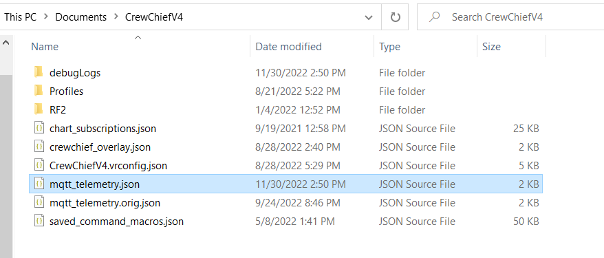

# FAQ

### I dont see any data

Downlad [mqtt_telemetry.json](https://gitlab.com/mr_belowski/CrewChiefV4/-/blob/master/CrewChiefV4/mqtt_telemetry.json)
and place it into your `Documents/CrewChiefV4` folder.

### I dont hear anything

Make sure you have enabled text to speech in the CrewChief properties.

### What do those messages mean?

* `Gear 4 - 20 percent` - you should be in 4th gear and brake with 20 percent maximum force
